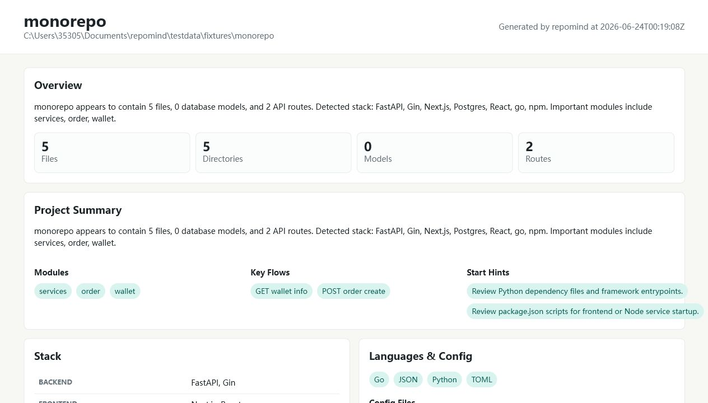

# RepoMind

**Language:** English | [简体中文](README.zh-CN.md)

Understand Any Repository in 30 Seconds.

[](https://github.com/patrick892368/RepoMind/actions/workflows/ci.yml)
[](https://github.com/patrick892368/RepoMind/actions/workflows/release.yml)
[](https://github.com/patrick892368/RepoMind/actions/workflows/release-gate.yml)

RepoMind is a CLI-first repository understanding tool. It scans an existing codebase and generates a structured report with stack detection, database models, API routes, Mermaid diagrams, call graphs, AI summaries, and export files for AI coding tools.

RepoMind is not an AI agent and does not generate application code by default. Its job is to turn an unfamiliar repository into useful context for developers and tools like Codex, Claude Code, and Cursor.

## Report Preview



## Current Status

This repository is in early development. The core CLI and analysis pipeline are implemented, but parser coverage is still intentionally lightweight and will improve through real repository testing.

Implemented commands:

```bash
repomind analyze .
repomind analyze https://github.com/owner/repo.git
repomind ask . --question "where is order created?"
repomind ask . --question "where is order created?" --ai grok --ai-model grok-4.3
repomind trace . --symbol pay_callback
repomind diagnose . --issue "order status error"
repomind export codex .
repomind export claude .
repomind export cursor .
```

## Evaluation Snapshot

Latest local benchmark results are under the 30-second target:

| Repository | Time |
|---|---:|
| Laravel | 7.41s |
| Spring REST service | 1.94s |
| Gin examples | 1.32s |
| FastAPI full-stack template | 2.99s |
| Prisma examples | 9.68s |

Details:

- `docs/PERFORMANCE_BENCHMARKS.md`
- `docs/REAL_REPO_EVALUATION.md`

## Quick Start

Run from source:

```bash
go run ./cmd/repomind analyze .
```

Analyze a GitHub repository URL:

```bash
go run ./cmd/repomind analyze https://github.com/owner/repo.git
```

Analyze a branch, tag, or commit SHA:

```bash
go run ./cmd/repomind analyze --ref main https://github.com/owner/repo.git
```

Reuse a local Git cache for repeated remote analysis:

```bash
go run ./cmd/repomind analyze --repo-cache .repomind/repo-cache https://github.com/owner/repo.git
```

Remote Git inputs are cloned with `git clone --depth 1` into a temporary directory. When `--output` is relative, the report is written under your current working directory.

Remote repository usage, private repository authentication, proxy setup, ref selection, and clone cache behavior are documented in:

```txt
docs/REMOTE_REPOSITORIES.md
```

This writes:

```txt
.repomind/analysis.json
.repomind/report.html
```

Open `.repomind/report.html` in a browser to inspect the generated report.

Generate Chinese output:

```bash
go run ./cmd/repomind analyze --lang zh .
```

Supported output languages:

- `en` for English
- `zh` for Simplified Chinese

Installation options are documented in:

```txt
docs/INSTALL.md
```

## AI Summary Providers

By default RepoMind runs in offline mode and does not call a network AI provider.

Supported network providers:

```bash
go run ./cmd/repomind analyze --ai openai --ai-model gpt-4.1-mini .
go run ./cmd/repomind analyze --ai claude --ai-model claude-sonnet-4-5 .
go run ./cmd/repomind analyze --ai gemini --ai-model gemini-2.5-flash .
go run ./cmd/repomind analyze --ai grok --ai-model grok-4.3 .
```

Create a local `.env` file:

```env
OPENAI_API_KEY=your_openai_key_here
ANTHROPIC_API_KEY=your_anthropic_key_here
GEMINI_API_KEY=your_gemini_key_here
GROK_API_KEY=your_key_here
HTTPS_PROXY=http://127.0.0.1:10809
# or:
# ALL_PROXY=socks5://127.0.0.1:10808
```

`.env` is ignored by Git. Do not commit API keys.

RepoMind only sends the structured analysis summary to the selected AI provider. It does not upload the full repository source by default.

## AI Repository Questions

After running `analyze`, ask repository-specific questions:

```bash
go run ./cmd/repomind ask . --question "where is order created?"
go run ./cmd/repomind ask . --question "where is order created?" --ai grok --ai-model grok-4.3
go run ./cmd/repomind ask . --question "where is order created?" --ai grok --strict
```

Offline ask mode uses `.repomind/analysis.json` to rank candidate files, handlers, models, routes, and call-chain edges.

AI ask mode sends only structured analysis facts and small candidate source snippets to the selected provider. Provider-returned files, handlers, models, routes, call-chain edges, and evidence are validated against local analysis before they are kept.

Ask results include an Evidence section with local file paths and line ranges when RepoMind can verify the answer. `--strict` requires local evidence; when no evidence is available, RepoMind returns an insufficient-evidence answer instead of relying on AI inference.

Ask writes reusable results to:

```txt
.repomind/ask/last-answer.json
.repomind/ask/last-answer.md
```

Evaluate ask quality with fixed repository questions:

```powershell
.\scripts\evaluate-ask.ps1 -Provider offline -Strict
.\scripts\preflight.ps1 -IncludeAskEvaluation -AskProvider mock -AskStrict
.\scripts\evaluate-ask.ps1 -Provider offline -Strict -CasesPath docs\examples\ask-cases.example.json
```

Cross-platform Go CLI equivalent:

```bash
go run ./cmd/repomind eval ask --cases docs/examples/ask-cases.example.json --strict
```

The evaluator checks English and Chinese questions across API routes, database models, call-chain edges, handlers, evidence types, and local evidence counts, then writes `summary.json` and `summary.md`. See [Ask Evaluation](docs/ASK_EVALUATION.md) for custom case files.

## Supported Detection

Stack detection:

- Python: Django, FastAPI, Celery
- JavaScript / TypeScript: React, Vue, Next.js, Express, NestJS, BullMQ
- PHP: Laravel, Symfony, ThinkPHP
- Java: Spring Boot
- Go: Gin, Chi, Echo, Fiber
- Databases: Postgres, MySQL, SQLite, MongoDB
- Cache: Redis
- Package managers: npm, pnpm, yarn, pip, poetry, composer, Maven, Gradle, Go modules
- Monorepo package grouping: package roots from `package.json`, `pyproject.toml`, `requirements.txt`, `go.mod`, `composer.json`, `pom.xml`, `build.gradle`, and `schema.prisma`

Database model extraction:

- Prisma
- Django Models
- SQLAlchemy
- SQLModel
- TypeORM
- Java JPA
- Go GORM

API route extraction:

- Django URL patterns
- FastAPI decorators
- Express routes
- NestJS controllers
- Laravel routes
- Spring controllers
- Go router calls

## AI Coding Tool Export

After analyzing a repository, export context files:

```bash
go run ./cmd/repomind export codex .
go run ./cmd/repomind export claude .
go run ./cmd/repomind export cursor .
```

Generated files include:

```txt
AGENTS.md
CLAUDE.md
.cursor/rules/repomind.md
.repomind/context.md
.repomind/architecture.md
.repomind/api-map.md
.repomind/db-schema.md
```

## Development

Run tests:

```bash
go test ./...
```

Run vet:

```bash
go vet ./...
```

Run a local analysis:

```bash
go run ./cmd/repomind analyze .
```

Run the default local preflight checks:

```powershell
.\scripts\preflight.ps1
```

Run preflight with current-platform binary smoke:

```powershell
.\scripts\preflight.ps1 -IncludeReleaseSmoke
```

Run the full local release gate:

```powershell
.\scripts\release-gate.ps1 -Proxy http://127.0.0.1:10809
```

The release gate includes tests, CLI smoke, ask evaluation, release binary smoke, benchmark, evaluation quality checks, and release manifest verification.

Run with a network AI provider through a local HTTP proxy:

```bash
$env:HTTPS_PROXY="http://127.0.0.1:10809"
go run ./cmd/repomind analyze --ai openai --ai-model gpt-4.1-mini .
```

The same proxy variables are also useful when analyzing GitHub URLs from restricted networks.

Run the optional local AI provider smoke script:

```powershell
.\scripts\smoke-ai-provider.ps1 -Provider grok -Model grok-4.3 -Proxy http://127.0.0.1:10809
```

## Build

Build the current platform binary:

```bash
go build -o repomind ./cmd/repomind
```

Build release artifacts for Windows, macOS, and Linux:

```powershell
.\scripts\build-release.ps1 -Version v0.1.0
```

Smoke test the current platform binary workflow:

```powershell
.\scripts\smoke-release-artifact.ps1
```

Artifacts are written to:

```txt
dist/
```

Release builds also generate:

```txt
dist/manifest.json
dist/manifest.md
```

Verify a release manifest:

```powershell
.\scripts\verify-release-manifest.ps1 -DistDir dist
```

## Release

GitHub Releases are built from version tags:

```bash
git tag v0.1.0
git push origin v0.1.0
```

The release workflow builds:

- Windows amd64 / arm64
- macOS amd64 / arm64
- Linux amd64 / arm64

Each archive includes the `repomind` binary, `LICENSE`, `README.md`, `README.zh-CN.md`, and `.env.example`.

## License

RepoMind is released under the [MIT License](LICENSE).

## Boundaries

RepoMind does not:

- Modify application source code by default.
- Generate business code by default.
- Upload source code unless a network AI provider is explicitly enabled.
- Replace Codex, Claude Code, Cursor, or other AI coding tools.

RepoMind should provide the repository understanding layer those tools can consume.
